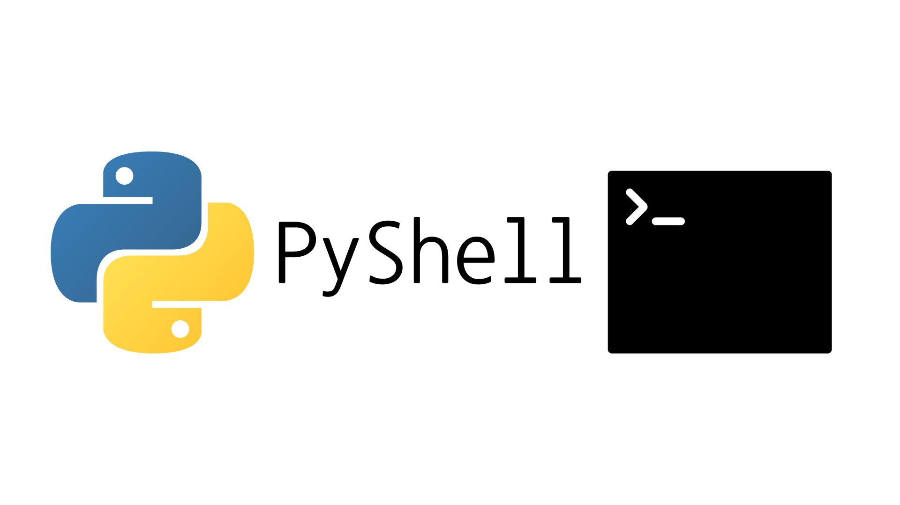

# PyShell

A shell based on Python 🐍

## Set Up

Run


```bash
pip install -r requirements.txt
```

or

```bash
pip3 install -r requirements.txt
```

and than

```bash
python main.py
```

or

```bash
python3 main.py
```


## Command List

| Commdand | Argument | 
| --- | ----------- | 
| quit |  | 
| exit |  | 
| clear |  | 
| cls |  | 
| ls | path | 
| pwd |  | 
| cd | path | 
